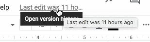

Google Docs Last Edit Label
===========================

A user script that adds a tooltip to the Google Docs “Last edit” link, allowing
the full label to be read even if the text is cut off.

## Install
Open the [raw script][1] and click “Install” in the resulting dialog. A [more
detailed explanation][2] is available on the Greasemonkey wiki.

## License
Copyright © 2021 Teddy Wing. Licensed under the GNU GPLv3+ (see the included
COPYING file).

[1]: https://raw.githubusercontent.com/teddywing/google-docs-last-edit-label/master/google-docs-last-edit-label.user.js
[2]: https://wiki.greasespot.net/Greasemonkey_Manual:Installing_Scripts
